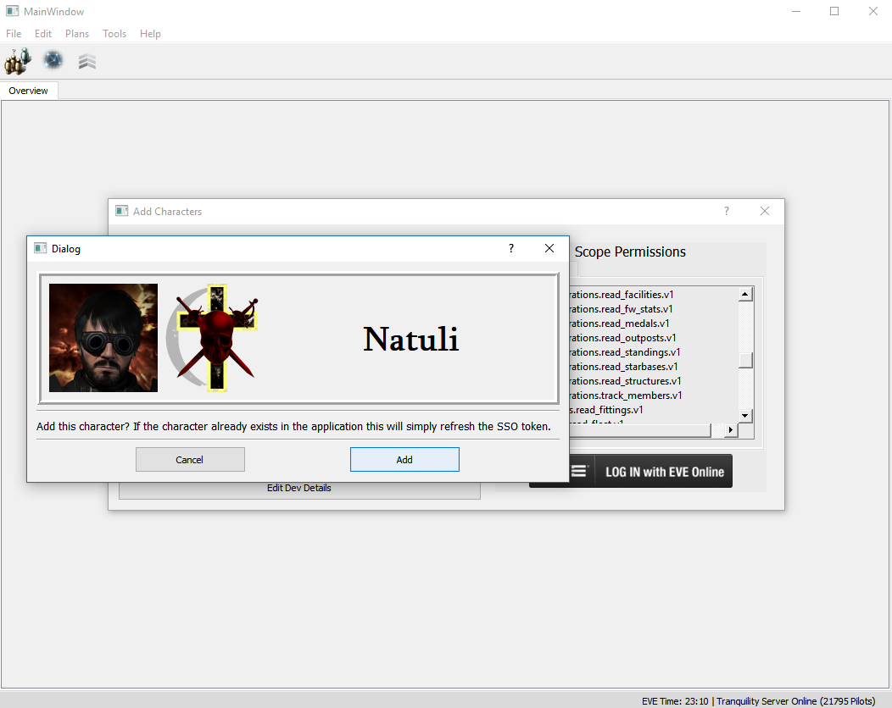
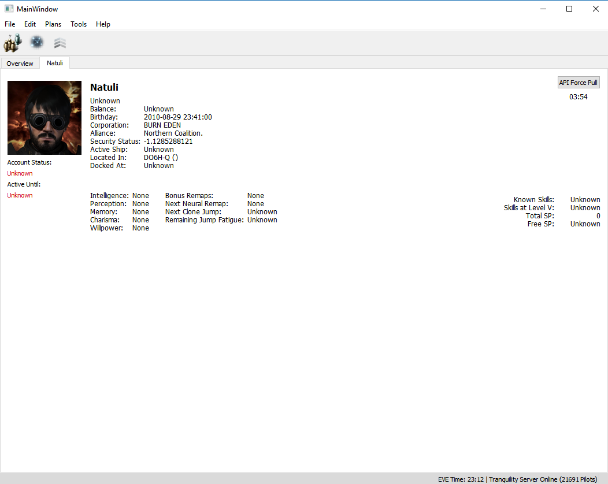

# ECM (EVE Character Manager) v0.1.0
An early character manager/utility prototype, inspired by the discontinued [EVEmon project.](https://github.com/evemondevteam/evemon)

This project is a work in progress so expect bugs and rapid changes.

Progress: Late May 2018 through mid-June 2018.

# Technology
## Core libraries
* PyQt 5 - GUI
* SQLAlchemy - SQLite database access
* Flask - callback listener

# Screenshots

